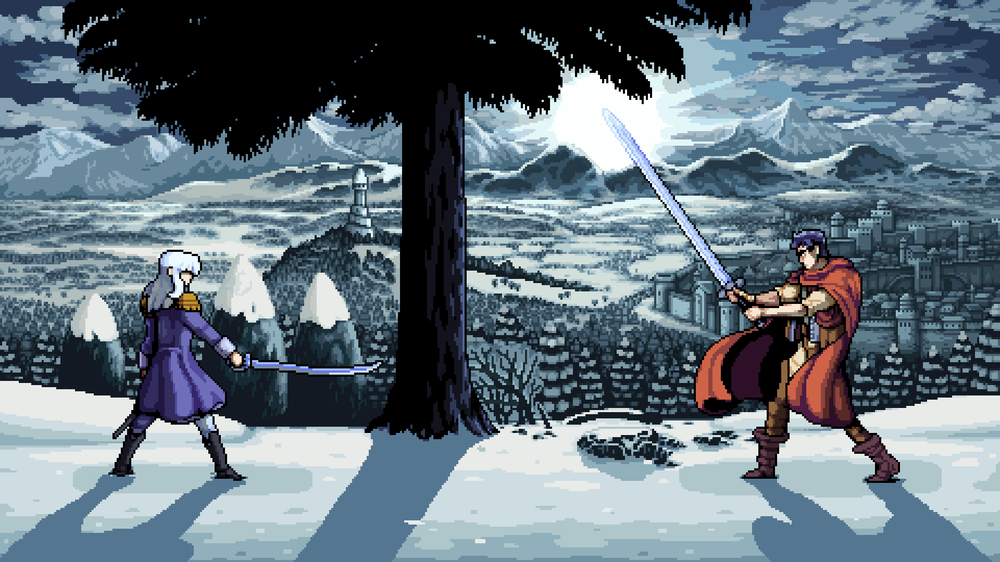

# Hello, I'm CHANDAN KARMAKER👋

## 💫 About me

I am a **Computer Science student** passionate about turning ideas into **solid, scalable, and well-designed digital products.** I work from **back-end to interface**, always prioritizing clean architecture, code organization, and user experience. 

I am currently developing several key projects that combine a robust backend with modern frontend frameworks:

  

  

    <h3>Featured Projects & Interests</h3>
    

      <b>English Janala</b> — 
      <a href="https://chandan-d-karmaker.github.io/english-janala/">Live Demo</a> | 
      <a href="https://github.com/chandan-d-karmaker/english-janala">Source Code</a>  
      <i>A platform for effective English learning.</i>
    

    

      <b>Job Application Tracker</b> — 
      <a href="https://chandan-d-karmaker.github.io/job-application-tracker/">Live Demo</a> | 
      <a href="https://github.com/chandan-d-karmaker/job-application-tracker">Source Code</a>  
      <i>Managing career workflows and applications.</i>
    

    

      <b>GitHub Issue Tracker</b> — 
      <a href="https://chandan-d-karmaker.github.io/github-issue-tracker/">Live Demo</a> | 
      <a href="https://github.com/chandan-d-karmaker/github-issue-tracker">Source Code</a>  
      <i>Manage, view, and organize repository issues efficiently.</i>
    

    

      🛠️ <b>Technical interests:</b> System architecture, well-designed APIs, and Database optimization.  
      🎨 <b>UI/UX:</b> Prototyping and modern interface design with Tailwind CSS and DaisyUI.
    

  

 

## 💻 I've worked with these(+more):

   

  

    

  
## 🌐 Contacts

   

  
   

  
  

