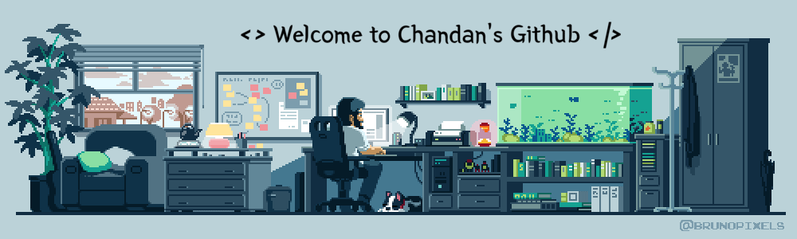

<div align="center">




<br/>

[](#)

<br/>


</div>

---

## 🧬 About Me

```bash
const dev = {
  name: "Chandan Karmaker",
  role: "Full Stack Web Developer (MERN)",
  education: "B.Sc. in Computer Science & Engineering",
  currentFocus: "Becoming a better full stack web developer",
  hobbies: ["Reading Manga", "Watching Anime", "Gaming", "Sketching"],
  coffeeLine: "Converted to code at a 1:1 ratio"
};
```

I'm a **Full Stack Developer** working primarily with the **MERN stack**, focused on building clean, functional, and well-architected web applications — from responsive frontends to robust backend APIs. I care about **system architecture**, **well-designed APIs**, and **database optimization**, and enjoy shaping interfaces with **Tailwind CSS** and **DaisyUI** (sometims **HeroUI**).

Outside of code, I spend my time reading manga, watching anime, gaming, and sketching anime artwork.

<div align="center">

### 🎯 Open To


</div>

---

## 🛠️ Tech Stack

**Languages**

     
 

**Frontend**

    

**Backend & Databases**

    

**Cloud, DevOps & Tooling**

   

---
## 🚀 Featured Projects

<details>
<summary><b>🔹 Mediqueue — Keep Your Tutors Tracked</b></summary>
<br/>

A platform designed to help track tutors efficiently, streamlining scheduling and management workflows.

| Attribute | Details |
|---|---|
| **Stack** | React, Tailwind CSS, Node.js, Express, MongoDB |
| **Description** | Keep Your Tutors Tracked |
| **Live Demo** | [mediqueue-client-ck.vercel.app](https://mediqueue-client-ck.vercel.app/) |
| **Repository** | [View Source](https://github.com/chandan-d-karmaker/mediqueue-client) |

</details>

<details>
<summary><b>🔹 Fable — Ebook Sharing Platform</b></summary>
<br/>

An ebook sharing platform that lets users discover, share, and manage digital reading content.

| Attribute | Details |
|---|---|
| **Stack** | React, Tailwind CSS, Node.js, Express, MongoDB |
| **Description** | Ebook Sharing Platform |
| **Live Demo** | [fable-client-psi.vercel.app](https://fable-client-psi.vercel.app/) |
| **Repository** | [View Source](https://github.com/chandan-d-karmaker/fable-client) |

</details>

<details>
<summary><b>🔹 English Janala — Effective English Learning Platform</b></summary>
<br/>

A platform built to support effective and structured English learning.

| Attribute | Details |
|---|---|
| **Stack** | HTML5, CSS3, JavaScript |
| **Description** | A platform for effective English learning |
| **Live Demo** | [chandan-d-karmaker.github.io/english-janala](https://chandan-d-karmaker.github.io/english-janala/) |
| **Repository** | [View Source](https://github.com/chandan-d-karmaker/english-janala) |

</details>

---

## 🎨 Beyond Code

🛠️ **Technical interests:** System architecture, well-designed APIs, and database optimization.
<br/>
🎨 **UI/UX:** Prototyping and modern interface design with Tailwind CSS and DaisyUI.
<br/>
🖼️ **Sketch:** Check out some of my anime artwork on [Facebook](https://www.facebook.com/profile.php?id=61555913942661).

---

## 📫 Connect With Me

<div align="center">

[](mailto:chandankarmaker555@gmail.com)
[](https://linkedin.com/in/chandankarmaker)
[](https://www.reddit.com/user/ckaditya202/)
[](https://x.com/chandank202)
[](https://www.pinterest.com/chandanDkarmaker/)
[](https://github.com/chandan-d-karmaker)
[](https://discord.com/users/725361207741251665)

</div>

---

## 📊 GitHub Analytics

<div align="center">

<!-- 

 -->


</div>

---

## 📈 Contribution Activity

<div align="center">


</div>

---

## 🔭 Current Focus

```yaml
learning:
  - Advanced React patterns and Next.js architecture
  - Backend system design and API best practices
building:
  - Full stack MERN projects with polished UI/UX
  - Personal tools and open source experiments
exploring:
  - Database optimization techniques
  - Modern UI design with Tailwind CSS and DaisyUI
open_to:
  - Full time Full Stack Developer roles
  - Freelance and collaborative projects
```

---

<div align="center">

<!-- *"Converted coffee to code at a 1:1 ratio."* -->

<!--  -->

</div>
